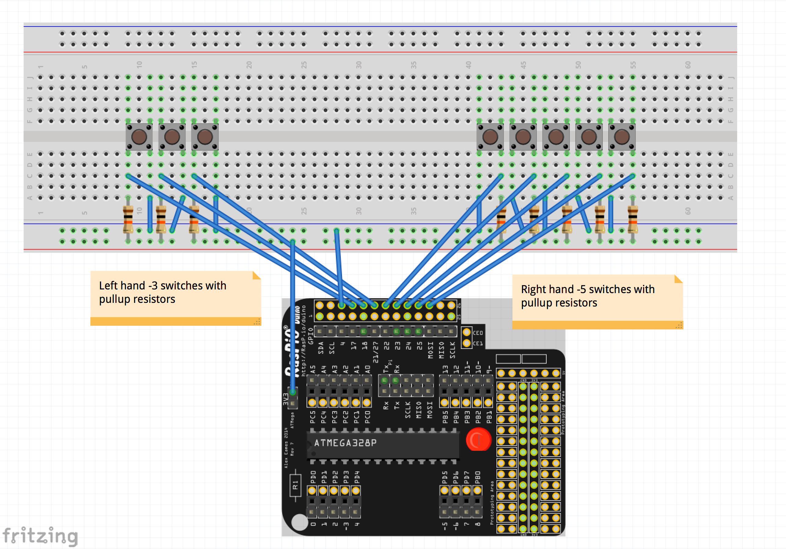
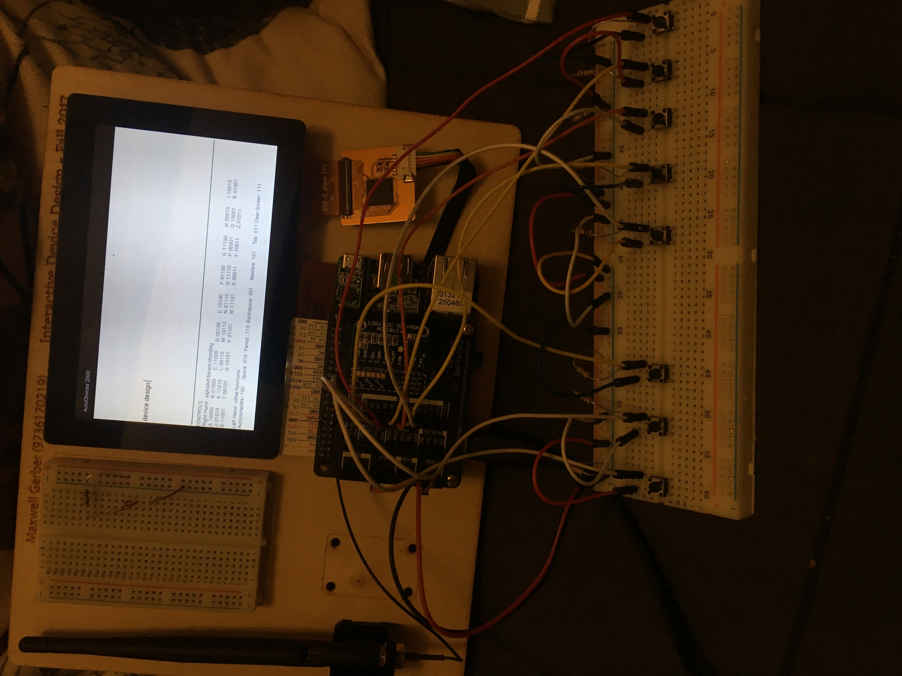

IDD-fall17 Homework 2: Text Entry Device
=====================================

This github repo can be found at {}

## What text entry methiod you chose and why

I implemented chording using a binary alphabet. 1 maps to a, 2 maps to b, and so on. I chose this method because chording only requires five switches and one hand to implement, freeing up the other hand for some fun features. Since chording is simple to program and doesn't require me to display interactive feedback/help from the user, I had time to  build an autocompleting tool that integrated with the keyboard.

## How does it work?

We have a keyboard with three keys on the left side and five keys on the right. 
We store a set of all the keys pressed for each hand. When we release all keys for a 
given hand, we hash that set to an integer and perform a specific action depending on the integer value.
For the right hand, that means appending a single character to the string being displayed to the user.
For the left hand, that could mean punctuation, backspace, whitespace or autocomplete. 

In order to implement the autocomplete, I found a corpus of the 6000 most common English words and filtered out all words shorter than 3 letters.
On every keystroke, I find the shortest word in this corpus that is prefixed with the currently entered stub. I display this word to the user for feedback.

The physical device is constructed rather crudely - just a large breadboard with lots of jumper cables. There are 8 switches on the board, each with their own pull-up resistor. Each switch is tied to a GPIO pin on the pico pro board. When a switch is pressed, the GPIO pin is pulled LOW and an interrupt routine on the board is called. When the switch is released, the GPIO pin is pulled high and a different routine is called

## Reflection

I definitely didn't realize how hard constructing hardware was going to be. I originally wanted to lazer cut a box and mount the switches in
there, but waited too long and couldn't get any time with the lazer. Wiring and writing the code were relatively straightforward. The only new part
part was learning how to work with the Android ecosystem for things like highlighting text and positioning the layout of the UI. As far as difficulty goes,
I don't think this homework was too bad.

## Material

